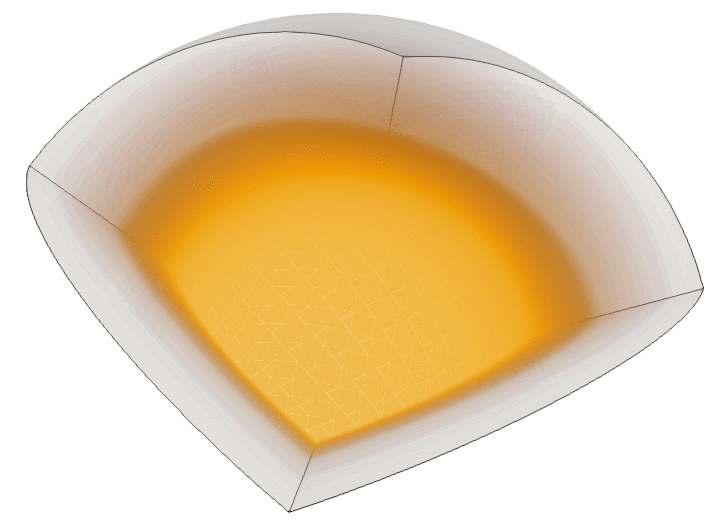
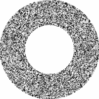
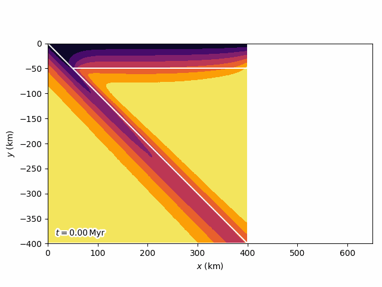

# Computational geophysics examples with [DOLFINx](https://github.com/FEniCS/dolfinx)

| Example                 | Image                                                     |
|-------------------------|-----------------------------------------------------------|
| Sectant cell convection |  |
| Porosity shear bands    |               |
| Subduction zone         |  |
