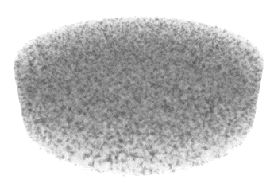

# Computational geophysics examples with [DOLFINx](https://github.com/FEniCS/dolfinx)

All examples are written to be compatible with DOLFINx `v0.7.0`.

| Example                     | Image                                                                                                                                                              |
|-----------------------------|--------------------------------------------------------------------------------------------------------------------------------------------------------------------|
| Sectant cell convection     |                                                                                                           |
| Porosity shear bands        |                                                                                                                      |
| Subduction zone             |                                                                                                              |
| Thermal buoyancy benchmarks |    |