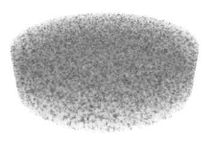

# Melt and shear modelling with DOLFINx

An implementation of a porosity, compaction pressure, velocity and
dynamics pressure model which gives rise to band formation opposing
the direction of shear.

| 2D | 3D                                           |
|----|----------------------------------------------|
|  |  |

References
* Katz et al. (2006) *The dynamics of melt and shear localization in partially molten aggregates*
* Spiegelman (2003) *Linear analysis of melt band formation by simple shear*

